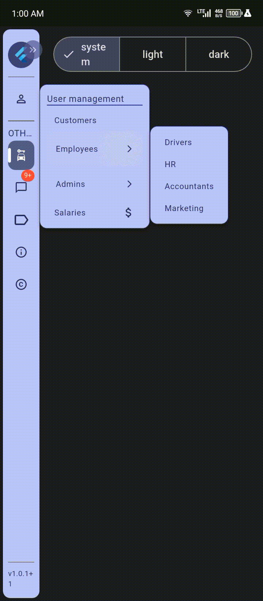
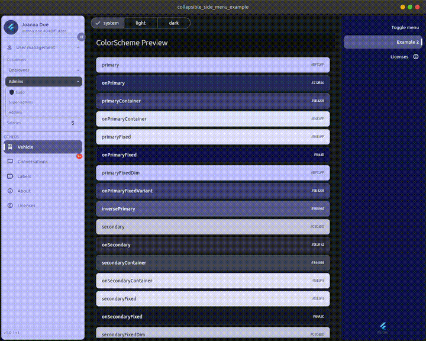
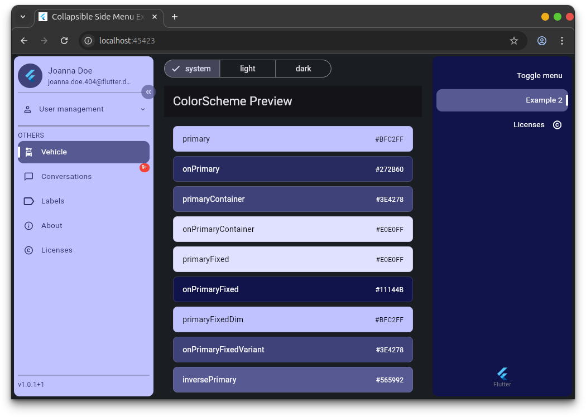

[](https://pub.dev/packages/collapsible_side_menu)
[](https://codecov.io/github/belinda-g-freitas/collapsible-side-menu)
[](https://pub.dev/packages/collapsible_side_menu/score)
[](https://github.com/belinda-g-freitas/collapsible-side-menu/actions/workflows/deploy-demo.yml)
[](https://github.com/belinda-g-freitas/collapsible-side-menu/blob/master/LICENSE)

<!-- <a href="https://github.com/belinda-g-freitas/collapsible-side-menu/issues"></a> -->
<!-- </a> -->

# collapsible_side_menu

`collapsible_side_menu` is a highly customizable Flutter package for building a collapsible side menu, with text direction (LTR & RTL) and sub-menu features.

|                       Mobile                        |                       Desktop                        |                     Web                      |
| :-------------------------------------------------: | :--------------------------------------------------: | :------------------------------------------: |
|  |  |  |

[Mobile](https://github.com/user-attachments/assets/50e1ac4b-c0af-46d2-b5c9-814edbdd310b) and [desktop](https://github.com/user-attachments/assets/964fe34e-0e02-425f-96d1-25a96e559a36) demo videos; or look here for live [demo](https://belinda-g-freitas.github.io/collapsible-side-menu/).

## Table of contents

- [collapsible\_side\_menu](#collapsible_side_menu)
  - [Table of contents](#table-of-contents)
  - [Features](#features)
  - [Usage](#usage)
    - [Installation](#installation)
    - [Import package](#import-package)
    - [Basic usage example](#basic-usage-example)
    - [🚩 BREAKING CHANGES from 1.x.x to 2.x.x](#-breaking-changes-from-1xx-to-2xx)
  - [Essentials](#essentials)
    - [Elements, types, usage and description](#elements-types-usage-and-description)
    - [Class, parameters, types and defaults](#class-parameters-types-and-defaults)
  - [⚠️ Notice](#️-notice)

## Features

- set menu animation duration
- set menu behaviour
- set menu text direction
- set toggle button and it's look
- add tiles and and their sub-tiles
- customize menu, tile and sub-tile look
- adaptive header widget (addon)

https://github.com/user-attachments/assets/964fe34e-0e02-425f-96d1-25a96e559a36

## Usage

### Installation

Add to your `pubspec.yaml`:

```yaml
dependencies:
  flutter:
    sdk: flutter
  # add this line
  collapsible_side_menu: latest_version
```

or run

```sh
flutter pub add collapsible_side_menu
```

### Import package

Add the following line to your code

```dart
import 'package:collapsible_side_menu/collapsible_side_menu.dart';
```

### Basic usage example

```dart
static const TextDirection menutextDirection = TextDirection.rtl;

CollapsibleSideMenu(
  defaultIndex: 3,
  defaultBehaviour: .open,
  menuStyle: SideMenuStyle(textDirection: menutextDirection),
  toggleButtonStyle: const ToggleButtonStyle(topPosition: 55, iconSize: 16),
  header: (_, isOpen) {
    return Column(
      crossAxisAlignment: .start,
      children: [
        Row(
          spacing: 10,
          mainAxisSize: .min,
          children: [
            const Flexible(child: CircleAvatar(radius: 22, child: FlutterLogo())),
            if (isOpen)
              const Flexible(
                flex: 2,
                child: Column(
                  crossAxisAlignment: .start,
                  children: [
                    Text(
                      'Joanna Doe',
                      overflow: .ellipsis,
                      style: TextStyle(fontWeight: .w500, fontSize: 14.5),
                    ),
                    Text(
                      'joanna.doe.404@flutter.dev',
                      overflow: .ellipsis,
                      style: TextStyle(fontSize: 12, fontWeight: .w300),
                    ),
                  ],
                ),
              ),
          ],
        ),
        const Divider(thickness: .5),
      ],
    );
  },
  footer: (_, isOpen) {
    return Column(
      mainAxisAlignment: .end,
      crossAxisAlignment: .start,
      children: [
        const Divider(thickness: .5),
        Text('v1.0.1+1', style: TextStyle(fontSize: isOpen ? 12 : 10)),
      ],
    );
  },
  items: [
    TileData(
      title: 'User management',
      leading: const Icon(Icons.person_outline, size: 18),
      selectedLeading: const Icon(Icons.person, size: 18),
      subTiles: [
        SubTileData(title: 'Customers'),
        SubTileData(
          title: 'Employees',
          subTiles: [
            SubTileData(title: 'Drivers'),
            SubTileData(title: 'HR'),
            SubTileData(title: 'Accountants'),
            SubTileData(title: 'Marketing'),
          ],
        ),
        SubTileData(
          title: 'Admins',
          subTiles: [
            SubTileData(
              onTap: () {
                ScaffoldMessenger.of(context).showSnackBar(const SnackBar(content: Text('Sudo')));
              },
              title: 'Sudo',
              leading: const Icon(Icons.shield, size: 18),
            ),
            SubTileData(title: 'Super-admins'),
            SubTileData(title: 'Admins'),
          ],
        ),
        SubTileData(title: 'Salaries', trailing: const Icon(Icons.attach_money, size: 18)),
      ],
    ),
    //
    const DividerData(),
    const TitleData(title: 'OTHERS'),
    TileData(onTap: () {}, title: 'Vehicle', leading: const Icon(Icons.car_rental, size: 18)),
    TileData(
      onTap: () {},
      title: 'Conversations',
      leading: const Icon(Icons.chat_bubble_outline, size: 18),
      selectedLeading: const Icon(Icons.chat_bubble, size: 18),
      /// use whatever badge package ou UI you want by wrapping tile with it
      badgeBuilder: (tile) => Badge.count(count: 100, maxCount: 9, offset: Offset(menutextDirection == .rtl ? 2 : -2, -4), child: tile),
    ),
    TileData(title: 'Labels', leading: const Icon(Icons.label_outline), selectedLeading: const Icon(Icons.label)),
    TileData(
      onTap: () {
        showAdaptiveAboutDialog(context: context);
      },
      title: 'About',
      leading: const Icon(Icons.info_outline, size: 18),
      selectedLeading: const Icon(Icons.info, size: 18),
    ),
    TileData(
      onTap: () {
        showLicensePage(context: context);
      },
      title: 'Licenses',
      leading: const Icon(Icons.copyright_outlined, size: 18),
      selectedLeading: const Icon(Icons.copyright, size: 18),
    ),
  ],
  onIndexChanged: (index) {
    debugPrint('current index: $index');
  },
),
```

### 🚩 BREAKING CHANGES from 1.x.x to 2.x.x

| NEW                                     |         Type         |                                                    Description |
| :-------------------------------------- | :------------------: | -------------------------------------------------------------: |
| SideMenuHeader                          |        Widget        | Menu header widget. Auto adapts to menu state changes (Addon). |
| SideMenuController().onCollapsedChanged | void Function(bool)  |                                                                |
| CollapsibleSideMenu().of(context)       | CollapsibleSideMenu  |         To access CollapsibleSideMenu members from descendants |
| CollapsibleSideMenu().maybeOf(context)  | CollapsibleSideMenu? |         To access CollapsibleSideMenu members from descendants |
| TileData().tooltip                      |       String?        |             To override default tooltip when menu is collapsed |

| REMOVED                          |          Type |
| :------------------------------- | ------------: |
| SideMenuController().isCollapsed | bool Function |
| TileData().id                    |       String? |
| SubTileData().id                 |       String? |

## Essentials

### Elements, types, usage and description

| Element                              |  Type  |    Usage    |                                                                                               Description |
| :----------------------------------- | :----: | :---------: | --------------------------------------------------------------------------------------------------------: |
| <a href="#0">CollapsibleSideMenu</a> | Widget | Menu widget |                                                                                      The side menu widget |
| <a href="#1">SideMenuStyle</a>       | Class  |    Style    |                                                                                      Menu container style |
| <a href="#2">MenuTileStyle</a>       | Class  |    Style    |                                                                                           Menu tile style |
| <a href="#3">SubMenuTileStyle</a>    | Class  |    Style    |                                                                                       Menu sub-tile style |
| <a href="#4">ToggleButtonStyle</a>   | Class  |    Style    |                                                              Toggle button style (to open/close the menu) |
| SideMenuController                   | Class  | Controller  |                                                                                           Menu controller |
| TitleData                            | Class  |    Data     |                         Add a simple text with custom style (with no background or tap callback) to items |
| DividerData                          | Class  |    Data     |                                                                      Add a custom divider widget to items |
| TileData                             | Class  |    Data     |                                                                                       Add a tile to items |
| SubTileData                          | Class  |    Data     |                                                                         Add a sub-tile to tile (TileData) |
| TileBadgeBuilder                     | Class  |   Builder   |                                                                           Data to build a badge on a tile |
| CustomChildPosition                  |  Enum  |    Enum     |                                            Position of the custom child related to items (above or below) |
| AutoOpenFrom                         |  Enum  |    Enum     | Set from what screen width the menu should adapt when <a href="#ref1">defaultBehaviour</a> is set to auto |

<br>

### Class, parameters, types and defaults

<table>

  <!-- header -->
  <tr>
    <th>Class</th>
    <th>Parameters</th>
    <th>Types</th>
    <th>Defaults</th>
  </tr>

  <!-- SideMenu -->
  <tr id="0">
    <td rowspan="17">CollapsibleSideMenu</td>
    <td>header</td>
    <td>MenuHeaderBuilder?</td>
    <td>null</td>
  </tr>
  <tr>
    <td>footer</td>
    <td>MenuHeaderBuilder?</td>
    <td>null</td>
  </tr>
  <tr>
    <td>customMenuChild</td>
    <td>CustomMenuChild?</td>
    <td>null</td>
  </tr>
  <tr>
    <td>items</td>
    <td>List&lt;SideMenuItem&gt;</td>
    <td>const []</td>
  </tr>
  <tr>
    <td>spacerAfterItems</td>
    <td>Spacer?</td>
    <td>null</td>
  </tr>
  <tr>
    <td>onIndexChanged</td>
    <td>ValueChanged&lt;int&gt;?</td>
    <td>null</td>
  </tr>
  <tr>
    <td>controller</td>
    <td>SideMenuController?</td>
    <td>null</td>
  </tr>
  <tr>
    <td id="ref1">defaultBehaviour</td>
    <td>MenuBehaviour</td>
    <td>MenuBehaviour.auto</td>
  </tr>
  <tr>
    <td>autoFrom</td>
    <td>AutoOpenFrom</td>
    <td>AutoOpenFrom.tablet</td>
  </tr>
  <tr>
    <td>minWidth</td>
    <td>double</td>
    <td>MenuConstants.minWidth</td>
  </tr>
  <tr>
    <td>maxWidth</td>
    <td>double</td>
    <td>MenuConstants.maxWidth</td>
  </tr>
  <tr>
    <td>hasToggleButton</td>
    <td>bool</td>
    <td>true</td>
  </tr>
  <tr>
    <td>toggleButtonStyle</td>
    <td><a href="#4">ToggleButtonStyle</a>?</td>
    <td>null</td>
  </tr>
  <tr>
    <td>duration</td>
    <td>Duration</td>
    <td>MenuConstants.duration</td>
  </tr>
  <tr>
    <td>animationCurve</td>
    <td>Curve</td>
    <td>Curves.linear</td>
  </tr>
  <tr>
    <td>menuStyle</td>
    <td><a href="#1">SideMenuStyle</a>?</td>
    <td>null</td>
  </tr>
  <tr>
    <td>defaultIndex</td>
    <td>int?</td>
    <td>null</td>
  </tr>

  <!-- SideMenuStyle -->
  <tr id="1">
    <td rowspan="7">SideMenuStyle</td>
    <td>backgroundColor</td>
    <td>Color?</td>
    <td>colorScheme.primary</td>
  </tr>
  <tr>
    <td>boxShadow</td>
    <td>BoxShadow?</td>
    <td>null</td>
  </tr>
  <tr>
    <td>textDirection</td>
    <td>TextDirection?</td>
    <td>Directionality.of(context)</td>
  </tr>
  <tr>
    <td>borderRadius</td>
    <td>BorderRadiusGeometry</td>
    <td>MenuConstants.borderRadius</td>
  </tr>
  <tr>
    <td>padding</td>
    <td>EdgeInsetsGeometry</td>
    <td>MenuConstants.menuInnerPadding</td>
  </tr>
  <tr>
    <td>margin</td>
    <td>EdgeInsetsGeometry</td>
    <td>MenuConstants.menuOuterPadding</td>
  </tr>
  <tr>
    <td>defaultTileStyle</td>
    <td><a href="#2">MenuTileStyle</a></td>
    <td>null</td>
  </tr>

  <!-- MenuTileStyle -->
  <tr id="2">
    <td rowspan="20">MenuTileStyle</td>
    <td>titleStyle</td>
    <td>TextStyle?</td>
    <td>TextStyle(fontSize: 13.7)</td>
  </tr>
  <tr>
    <td>selectedTitleStyle</td>
    <td>TextStyle?</td>
    <td>TextStyle(fontSize: 13.7, fontWeight: .w500)</td>
  </tr>
  <tr>
    <td>color</td>
    <td>Color?</td>
    <td>Set depending on menu background color luminance (if not null), else set to colorScheme.onPrimary</td>
  </tr>
  <tr>
    <td>selectedColor</td>
    <td>Color?</td>
    <td>It's set to Colors.black or Colors.white depending on colorScheme.inversePrimary luminance</td>
  </tr>
  <tr>
    <td>hoverColor</td>
    <td>Color?</td>
    <td>colorScheme.onSecondaryContainer</td>
  </tr>
  <tr>
    <td>backgroundColor</td>
    <td>Color</td>
    <td>MenuConstants.transparent</td>
  </tr>
  <tr>
    <td>selectedBackgroundColor</td>
    <td>Color?</td>
    <td>colorScheme.inversePrimary</td>
  </tr>
  <tr>
    <td>borderRadius</td>
    <td>BorderRadius</td>
    <td>MenuConstants.borderRadius</td>
  </tr>
  <tr>
    <td>decoration</td>
    <td>Decoration?</td>
    <td>BoxDecoration(borderRadius: MenuConstants.borderRadius)</td>
  </tr>
  <tr>
    <td>selectedDecoration</td>
    <td>Decoration?</td>
    <td>BoxDecoration(color: colorScheme.inversePrimary, borderRadius: MenuConstants.borderRadius)</td>
  </tr>
  <tr>
    <td>selectedIndicator</td>
    <td>Decoration?</td>
    <td>BoxDecoration(borderRadius: MenuConstants.borderRadius) with the right color</td>
  </tr>
  <tr>
    <td>selectedBorderWidth</td>
    <td>double</td>
    <td>MenuConstants.selectedBorderWidth</td>
  </tr>
  <tr>
    <td>padding</td>
    <td>EdgeInsetsGeometry</td>
    <td>EdgeInsets.zero</td>
  </tr>
  <tr>
    <td>margin</td>
    <td>EdgeInsetsGeometry</td>
    <td>MenuConstants.tileMargin</td>
  </tr>
  <tr>
    <td>subTileStyle</td>
    <td> SubMenuTileStyle?</td>
    <td>refer to <a href="#3">SubMenuTileStyle</a> section</td>
  </tr>
  <tr>
    <td>tileHeight</td>
    <td>double</td>
    <td>MenuConstants.tileHeight</td>
  </tr>
  <tr>
    <td>subTileHeight</td>
    <td>double</td>
    <td>MenuConstants.subTileHeight</td>
  </tr>
  <tr>
    <td>horizontalSpacing</td>
    <td>double</td>
    <td>MenuConstants.horizontalSpacing</td>
  </tr>
  <tr>
    <td>leadingIconSize</td>
    <td>double?</td>
    <td>null</td>
  </tr>
  <tr>
    <td>trailingIconSize</td>
    <td>double?</td>
    <td>null</td>
  </tr>
  
  <!-- SubMenuTileStyle -->
  <tr id="3">
    <td rowspan="18">SubMenuTileStyle</td>
    <td>titleStyle</td>
    <td>TextStyle?</td>
    <td>TextStyle(fontSize: 12.3)</td>
  </tr>
  <tr>
    <td>selectedTitleStyle</td>
    <td>TextStyle?</td>
    <td>TextStyle(fontSize: 12.3, fontWeight: .w500)</td>
  </tr>
  <tr>
    <td>selectedColor</td>
    <td>Color?</td>
    <td>colorScheme.onSecondaryContainer</td>
  </tr>
  <tr>
    <td>backgroundColor</td>
    <td>Color</td>
    <td>MenuConstants.transparent</td>
  </tr>
  <tr>
    <td>color</td>
    <td>Color?</td>
    <td>Set depending on background color luminance (if not null), else set to colorScheme.onSecondary</td>
  </tr>
  <tr>
    <td>hoverColor</td>
    <td>Color?</td>
    <td>colorScheme.onSecondaryContainer</td>
  </tr>
  <tr>
    <td>selectedBackgroundColor</td>
    <td>Color?</td>
    <td>null</td>
  </tr>
  <tr>
    <td>borderRadius</td>
    <td>BorderRadius</td>
    <td>MenuConstants.borderRadius</td>
  </tr>
  <tr>
    <td>decoration</td>
    <td>Decoration?</td>
    <td>BoxDecoration(borderRadius: MenuConstants.borderRadius)</td>
  </tr>
  <tr>
    <td>selectedDecoration</td>
    <td>Decoration?</td>
    <td>BoxDecoration(color: colorScheme.secondaryContainer, borderRadius: MenuConstants.borderRadius)</td>
  </tr>
  <tr>
    <td>selectedBorderWidth</td>
    <td>double</td>
    <td>MenuConstants.selectedBorderWidth</td>
  </tr>
  <tr>
    <td>padding</td>
    <td>EdgeInsetsGeometry</td>
    <td>EdgeInsets.zero</td>
  </tr>
  <tr>
    <td>margin</td>
    <td>EdgeInsetsGeometry</td>
    <td>MenuConstants.tileMargin</td>
  </tr>
  <tr>
    <td>horizontalSpacing</td>
    <td>double</td>
    <td>MenuConstants.horizontalSpacing</td>
  </tr>
  <tr>
    <td>defaultSubTilesStyle</td>
    <td>SubMenuTileStyle?</td>
    <td>null</td>
  </tr>
  <tr>
    <td>tileHeight</td>
    <td>double</td>
    <td>MenuConstants.subTileHeight</td>
  </tr>
  <tr>
    <td>leadingIconSize</td>
    <td>double?</td>
    <td>null</td>
  </tr>
  <tr>
    <td>trailingIconSize</td>
    <td>double?</td>
    <td>null</td>
  </tr>

  <!-- ToggleButtonStyle -->
  <tr id="4">
    <td rowspan="6">ToggleButtonStyle</td>
    <td>iconColor</td>
    <td>Color?</td>
    <td>null</td>
  </tr>
  <tr>
    <td>topPosition</td>
    <td>double</td>
    <td>20.0</td>
  </tr>
  <tr>
    <td>opacity</td>
    <td>double</td>
    <td>0.7</td>
  </tr>
  <tr>
    <td>iconSize</td>
    <td>double</td>
    <td>20.0</td>
  </tr>
  <tr>
    <td>icon</td>
    <td>IconData?</td>
    <td>null</td>
  </tr>
  <tr>
    <td>backgroundColor</td>
    <td>Color?</td>
    <td>ColorScheme.of(context).inversePrimary</td>
  </tr>

</table>

<br>

## ⚠️ Notice

This package was only tested on Android, Linux and web so feedback is needed for other platforms.
